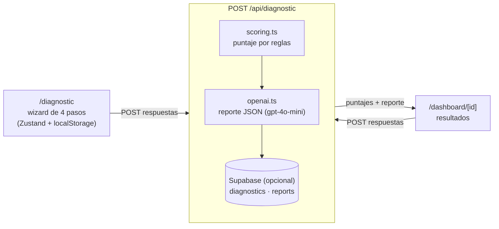

# Acámbaro Impulsa IA

Prototipo de diagnóstico de madurez digital para PyMEs, pensado para negocios de Acámbaro, Gto.: un cuestionario de 4 pasos produce un puntaje por reglas y un reporte con plan de acción a 90 días generado con IA.

## Problema

Una PyME que quiere adoptar IA suele no tener claro en qué punto está en presencia digital, en ventas y marketing, y en uso de IA, ni qué conviene hacer primero. Este prototipo explora cómo automatizar un primer diagnóstico.

## Solución

Un asistente web guía por 4 pasos (datos del negocio, presencia digital, ventas y marketing, y uso de IA) y entrega:

1. **Puntaje por reglas.** Cada dimensión suma de 0 a 100 con reglas fijas ([`src/lib/scoring.ts`](src/lib/scoring.ts)). El total pondera presencia digital 35 %, ventas y marketing 35 % y uso de IA 30 %, y asigna un nivel: Inicial (0-40), Intermedio (41-70) o Avanzado (71-100).
2. **Reporte con IA.** Con las respuestas y los puntajes, un modelo de OpenAI (`gpt-4o-mini`) devuelve un JSON con resumen ejecutivo, fortalezas, oportunidades, recomendaciones y un plan de acción a 90 días ([`src/lib/openai.ts`](src/lib/openai.ts)).
3. **Dashboard.** Muestra el puntaje general y por dimensión, el resumen ejecutivo con fortalezas y oportunidades, un mapa radar de madurez, las recomendaciones y el plan de 90 días. El resultado se puede imprimir.

## Arquitectura



| Ruta | Qué contiene |
|---|---|
| `src/app/` | Páginas (`/`, `/diagnostic`, `/dashboard/[id]`) y la ruta `POST /api/diagnostic` |
| `src/components/diagnostic/` | El wizard y sus 4 pasos |
| `src/components/dashboard/` | Tarjetas de puntaje, resumen ejecutivo, radar, recomendaciones y plan de acción |
| `src/components/ui/` | Componentes base de shadcn/ui |
| `src/lib/` | `scoring.ts` (reglas), `openai.ts` (reporte con IA) y `supabase/` (clientes) |
| `src/store/` | Estado del wizard (Zustand, persistido en el navegador) |
| `supabase/schema.sql` | Tablas `profiles`, `companies`, `diagnostics` y `reports`, con RLS |

## Stack

Next.js 16 (App Router) · React 19 · TypeScript · Tailwind CSS 4 · shadcn/ui · Recharts · Zustand · OpenAI SDK · Supabase (opcional)

## Cómo ejecutar

**Requisitos:** Node.js 20.9 o superior (lo exige Next.js 16) y una API key de OpenAI.

```bash
git clone https://github.com/atapia9/acambaro-impulsa-ia.git
cd acambaro-impulsa-ia
npm install
# crea .env.local con al menos OPENAI_API_KEY (ver la tabla)
npm run dev
```

Abre <http://localhost:3000>. Otros scripts: `npm run build`, `npm run start` y `npm run lint`.

**Variables de entorno** (`.env.local`, ignorado por git):

| Variable | ¿Obligatoria? | Para qué sirve |
|---|---|---|
| `OPENAI_API_KEY` | Sí | Genera el reporte con IA |
| `NEXT_PUBLIC_SUPABASE_URL`, `NEXT_PUBLIC_SUPABASE_ANON_KEY`, `SUPABASE_SERVICE_ROLE_KEY` | No | Guardar los diagnósticos en Supabase. La service role solo se usa en el servidor. |

Para usar Supabase, crea un proyecto y ejecuta `supabase/schema.sql` en su SQL Editor. Sin Supabase la app corre en modo demo: el reporte se genera igual y solo se omite el guardado. Para desplegar en Vercel, ver [DEPLOYMENT.md](DEPLOYMENT.md).

## Estado del proyecto

Prototipo, versión 0.1.0 (2 commits, junio de 2026).

- Sin pruebas automáticas ni CI.
- Sin autenticación: `POST /api/diagnostic` es público, no tiene límite de uso y cada llamada consume la API de OpenAI, que es de pago.
- El endpoint guarda con un usuario anónimo fijo (`00000000-0000-0000-0000-000000000000`).
- Las respuestas del cuestionario se envían a OpenAI para generar el reporte.
- El repositorio aún no incluye un archivo de licencia.

### Limitaciones conocidas

- **Doble llamada al modelo.** El wizard llama a `/api/diagnostic` al terminar y el dashboard vuelve a llamarlo al abrirse, así que cada diagnóstico genera dos reportes. Además, `/dashboard/[id]` usa las respuestas guardadas en el navegador: el `id` de la URL no recupera un reporte guardado.
- **Guardado en Supabase sin verificar.** El esquema no crea el usuario ni la empresa anónimos que usa el endpoint, y `diagnostics` tiene llaves foráneas hacia ellos. Si el guardado falla, el endpoint lo ignora y responde con un id de demostración (`demo_<marca de tiempo>`).
- **Sin reporte de IA si el modelo falla.** Si la llamada del dashboard falla, se muestran solo los puntajes calculados por reglas.

---

> Este material fue elaborado con asistencia de Claude (Anthropic) y revisado por Jesús Armando Tapia Gallegos.
